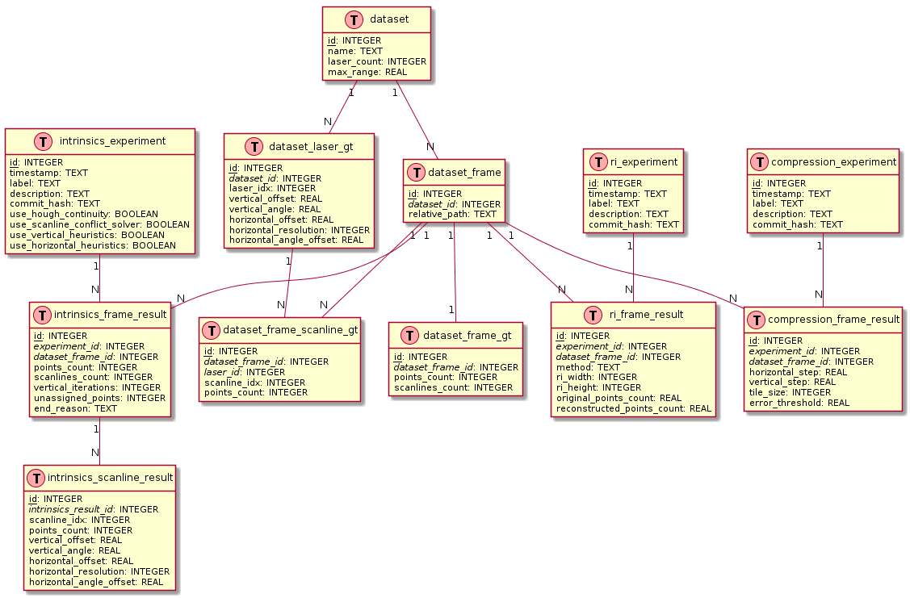

# Database Schema Documentation

This folder contains scripts for creating and populating the experiment database. The database uses SQLite and stores dataset metadata, ground truth information, and experiment results.

## Overview

The database schema is designed to support:
1. **Dataset and Frame Management**: References to KITTI and DurLAR datasets and their individual frames.
2. **Ground Truth Data**: Per-sensor reference intrinsic parameters and per-frame laser-scanline mappings.
3. **Experiment Results**: Results from intrinsics estimation, range image, and compression experiments.

## Entity-Relationship Diagram



### Core Dataset Tables

- **`dataset`**: Stores dataset metadata (KITTI, DurLAR).
- **`dataset_frame`**: Individual frames within each dataset, referenced by relative path.
- **`dataset_laser_gt`**: Per-sensor reference intrinsic parameters for each laser, fixed per dataset.
- **`dataset_frame_gt`**: Summary statistics for each frame's ground truth.
- **`dataset_frame_scanline_gt`**: Per-frame laser-scanline mappings, linking active scanlines to their corresponding lasers.

### Experiment Tables

Each experiment type follows a hierarchical pattern with different levels of detail:

#### Intrinsics Experiments (Three-Level Hierarchy)
1. **`intrinsics_experiment`**: Stores experiment configuration, including which algorithm components are enabled (Hough continuity, conflict solver, heuristics), along with timestamp, label, and description.
2. **`intrinsics_frame_result`**: Stores per-frame aggregated results, including total points/scanlines count, number of iterations, and termination reason.
3. **`intrinsics_scanline_result`**: Stores detailed per-scanline estimated intrinsic parameters, including vertical angles/offsets with confidence intervals, horizontal parameters, and Hough transform metadata.

#### Range Image and Compression Experiments (Two-Level Hierarchy)
1. **Experiment Metadata Table** (`ri_experiment`, `compression_experiment`): Stores experiment configuration, timestamp, label, and description.
2. **Frame Results Table** (`ri_frame_result`, `compression_frame_result`): Stores per-frame results with reconstruction metrics (MSE, RMSE) for range image experiments, or compression metrics (sizes, error thresholds, reconstruction quality) for compression experiments.

The intrinsics experiments require scanline-level detail because the algorithm estimates parameters for each individual scanline. In contrast, range image and compression experiments produce aggregate per-frame metrics without needing scanline-level granularity.

## Ground Truth Philosophy

The ground truth system implements a two-level approach to ensure fair and consistent evaluation:

### Level 1: Per-Sensor Reference Parameters (`dataset_laser_gt`)
- Contains fixed intrinsic parameters for each laser in a sensor, derived from manufacturer specifications and calibration data.
- Parameters include: elevation angles, vertical offsets, horizontal offsets, horizontal resolutions, and angular offsets.
- These values remain **constant across all frames** of a dataset to ensure consistent evaluation.

### Level 2: Per-Frame Laser-Scanline Mappings (`dataset_frame_scanline_gt`)
- Maps which predefined scanlines are present in each specific frame.
- Since not all laser beams always yield returns, the number of active scanlines $L$ may vary between frames.
- For each frame, this table records which lasers produced returns and maps them to their corresponding scanline indices.
- The intrinsic parameters themselves (from `dataset_laser_gt`) remain unchanged; only the presence/absence of scanlines varies.

This two-level design allows ALICE-LRI to be evaluated against consistent reference parameters while accounting for the practical reality that some laser beams may not return data in every frame.

## Usage

### Creating the Initial Database

Run [`create_initial_db.sh`](create_initial_db.sh) to generate the `initial.sqlite` database:

```bash
./create_initial_db.sh
```

This will:
1. Create the database schema from [`helper/experiments_db.sql`](helper/experiments_db.sql).
2. Scan the KITTI and DurLAR datasets (paths from `.env`).
3. Populate `dataset`, `dataset_frame`, and `dataset_laser_gt` tables with metadata and reference parameters.


To understand the overall workflow, see the main [REPRODUCIBILITY.md](../../../REPRODUCIBILITY.md).
